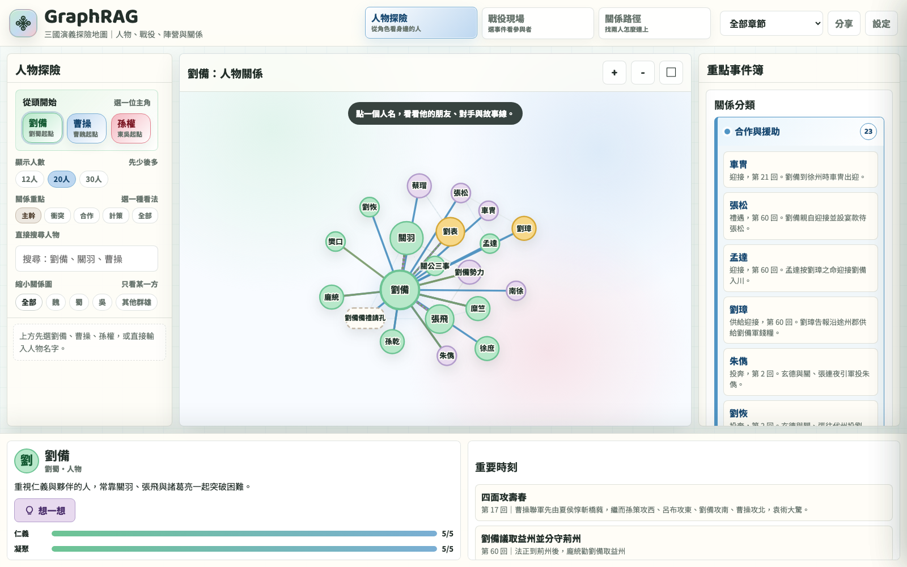

# GraphRag-Game · 三國演義探索地圖

把《三國演義》原文，用 GraphRAG 萃取成可探索的知識圖譜，再做成兒童友善的互動網頁。

🌍 **線上版**：https://leovibe.github.io/GraphRag-Game/

[](https://leovibe.github.io/GraphRag-Game/)

## 內容（5 大區塊）

| 區塊 | 內容 |
|---|---|
| `01_source/` | 原始全文（壓縮）|
| `02_chapters/` | 章節切分後的 .md（60 回） |
| `03_graphrag/` | 萃取結果（csv + json）+ 向量化資料 |
| `04_app/` | 互動網頁（v17 主檔 + `_archive/` 歷史版本） |
| `05_pipeline/` | 原文 → 圖譜 → 網頁的流程說明與 Python 腳本 |

### 03_graphrag 內容（Phase 1 後）

```
sanguo_v3_nodes.csv              GraphRAG v3 抽取的節點 (1534)
sanguo_v3_relationships.csv      v3 關係 (6615)
metadata.json                    社群、章節、統計 metadata
nodes.json                       前端 fetch 用，由 pipeline 產出
rels.json                        同上
character_personality.json       人物個性比例 + traits（287 位）
embeddings/  extract/  prompts/  unified/  settings.yaml   原有 GraphRAG 產出物
```

## 資料規模

- 60 回原文 → 120 個章節檔（每回約 2 個 chunk）→ 452 個更小 chunk
- 萃取出 **2,663 個實體**（人物、勢力、戰役、地點、策略）
- **5,049 條關係**（軍事衝突、陣營統率、謀略、親族、地點、官職、故事連結）
- **452 個向量**（768 維，embeddinggemma-300m 本地模型）

## 技術棧

- **LLM 萃取**：Codex CLI + GPT-5.5（每章一次萃取）
- **向量化**：本地 Ollama + `embeddinggemma:300m`
- **GraphRAG**：Microsoft GraphRAG 3.0.9 設定相容（`03_graphrag/settings.yaml`）
- **網頁**：純 D3.js v7 + 單檔 HTML（無需後端、無需安裝）

## 怎麼使用

### 想直接玩網頁
打開根目錄的 `三國演義探險地圖.html`（會自動轉址到當前主檔），或線上版連結。

### 想用這份資料做自己的應用
- 前端友善版本：`03_graphrag/nodes.json` + `rels.json` + `character_personality.json`
- 原始 csv：`03_graphrag/sanguo_v3_nodes.csv` + `sanguo_v3_relationships.csv`
- 章節原文：`02_chapters/c001.md ~ c060.md`
- 既有合併圖：`03_graphrag/unified/unified_entities.jsonl` + `unified_relationships.jsonl`

### 想重新產生 JSON（修改演算法或閾值時）

```bash
python3 05_pipeline/build_graph.py            # csv → nodes.json / rels.json
python3 05_pipeline/precompute_questions.py   # → character_personality.json
```

需要 Python 3.9+，無外部依賴（只用標準庫）。

### 跑測試

```bash
python3 -m unittest discover -s 05_pipeline/tests -v
```

### 想完整重跑萃取流程
看 `05_pipeline/README.md`，五個步驟對照五個程式。

## 當前設計

進行中的「人物圖鑑 × 關係偵探」設計脈絡：

- `docs/superpowers/specs/2026-05-23-sanguo-character-codex-design.md` — 整站結構、出題引擎、資料模型
- `docs/superpowers/specs/2026-05-23-sanguo-character-codex-interface-spec.md` — 三主題視覺、桌面與手機 layout、兒童 a11y
- `docs/superpowers/plans/2026-05-23-sanguo-codex-phase1-repo-and-data.md` — Phase 1 plan（已完成）

歷史 spec（v14-v17）在 `docs/spec_sanguo_v*.md` 保留供參。

## 授權

資料部分：《三國演義》原文為公共領域。

程式與互動網頁：MIT License。
